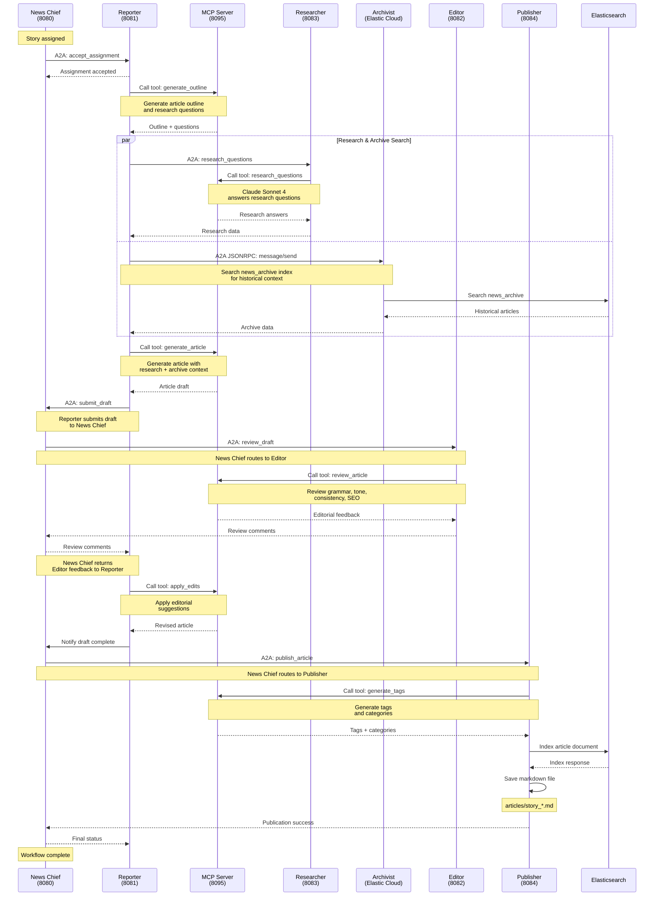

# Elastic News - Agent Sequence Diagram

This diagram shows the complete workflow from story assignment to publication, including all agent-to-agent (A2A) communications and MCP tool calls.

## Complete Workflow Sequence



## Key Components

### Agent-to-Agent (A2A) Protocol
- **News Chief → Reporter**: Story assignment
- **Reporter → Researcher**: Research request (direct)
- **Reporter → Archivist**: Historical search (JSONRPC 2.0, direct)
- **Reporter → News Chief**: Draft submission
- **News Chief → Editor**: Draft review (News Chief coordinates)
- **News Chief → Publisher**: Publication request (News Chief coordinates)

### MCP Tool Calls
All tools are provided by MCP Server (port 8095):

1. **generate_outline** (Reporter)
   - Input: Story topic, angle, target length
   - Output: Article outline + research questions

2. **research_questions** (Researcher)
   - Input: List of research questions
   - Output: Structured research data

3. **generate_article** (Reporter)
   - Input: Outline, research data, archive context
   - Output: Complete article draft

4. **review_article** (Editor)
   - Input: Article draft
   - Output: Editorial feedback + suggestions

5. **apply_edits** (Reporter)
   - Input: Article draft + editorial feedback
   - Output: Revised article

6. **generate_tags** (Publisher)
   - Input: Article content
   - Output: Tags and categories


## Parallel Processing

The Reporter performs research and archive search in parallel using `asyncio.gather()`:

```python
research_response, archive_response = await asyncio.gather(
    self._send_to_researcher(story_id, assignment, questions),
    self._send_to_archivist(story_id, assignment),
    return_exceptions=True
)
```

This reduces total workflow time by ~30 seconds.

## Timeouts

- Standard A2A calls: 90 seconds
- Archivist calls: 30 seconds (with 3 retry attempts)
- News Chief assignment: 60 seconds

## Error Handling

- **Researcher failure**: Warning logged, workflow continues
- **Archivist failure**: Exception raised, workflow halts
- **Editor failure**: Warning logged, returns draft without edits
- **Publisher failure**: Error logged, article not indexed (but saved locally)
